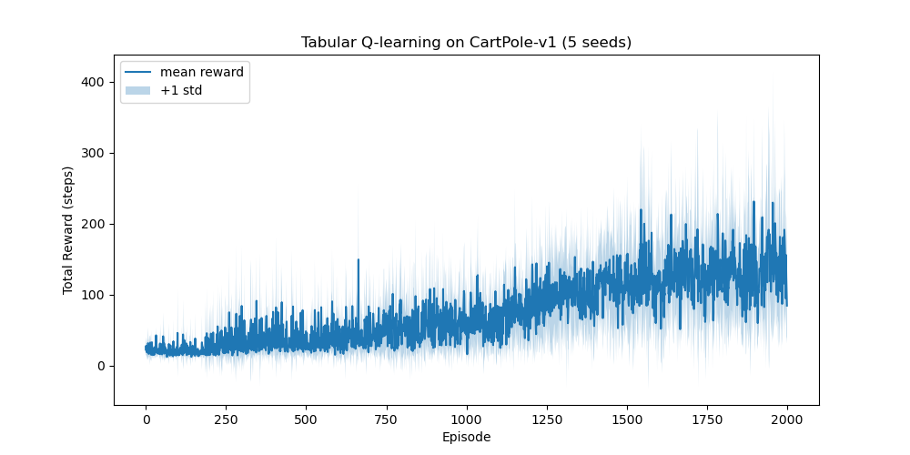

# CartPole to DQN: A Reinforcement Learning Journey

This repository documents my reinforcement learning learning path from tabular methods to deep reinforcement learning.

The current stage focuses on implementing **tabular Q-learning** on the classic `CartPole-v1` environment and evaluating the learning behavior using a **multi-seed experimental setup**.

---

## Project Overview

The long-term goal of this project is to build a solid reinforcement learning foundation by progressing from basic tabular methods to deep reinforcement learning.

The current stage focuses on:

- Markov Decision Processes (MDPs)
- Bellman update intuition
- Temporal-Difference learning
- Tabular Q-learning
- State discretization
- Multi-seed experimental evaluation
- Mean ± standard deviation learning curves

This stage is not intended to fully solve CartPole. Instead, it focuses on building a complete and reproducible reinforcement learning experimental pipeline.

---

## Current Status

### Stage 1: Tabular Q-learning on CartPole

Completed:

- Implemented the CartPole environment interaction loop using Gymnasium
- Discretized the continuous CartPole state space
- Implemented tabular Q-learning
- Used an ε-greedy exploration strategy
- Trained the agent across 5 random seeds
- Aggregated results using mean and standard deviation
- Visualized the learning curve with a shaded uncertainty band

---

## Environment

The experiment uses:

- Environment: `CartPole-v1`
- Library: `gymnasium`
- Observation space: continuous 4-dimensional state
- Action space: discrete actions `{0, 1}`

CartPole has a continuous state space, while tabular Q-learning requires discrete state indices. Therefore, the continuous observations are discretized before being used to index the Q-table.

The CartPole state contains:

- cart position
- cart velocity
- pole angle
- pole angular velocity

---

## Method

### State Discretization

The continuous state is converted into discrete bins.

```python
N_BINS = (6, 6, 12, 12)

STATE_BOUNDS = [
    (-4.8, 4.8),
    (-3.0, 3.0),
    (-0.418, 0.418),
    (-3.5, 3.5),
]
```

This allows the agent to use a Q-table with one value for each discrete state-action pair.

---

### Q-table

The Q-table is initialized with zeros:

```python
q_table_shape = N_BINS + (env.action_space.n,)
Q = np.zeros(q_table_shape)
```

Each entry `Q[state, action]` represents the estimated long-term return of taking an action from a discretized state.

---

### Q-learning Update Rule

The Q-table is updated using the standard Q-learning rule:

```text
Q(s, a) ← Q(s, a) + α [r + γ max Q(s', a') - Q(s, a)]
```

where:

- `α` is the learning rate
- `γ` is the discount factor
- `r` is the immediate reward
- `max Q(s', a')` is the estimated best future value from the next state

In this experiment:

```python
alpha = 0.1
gamma = 0.99
```

---

### Exploration Strategy

The agent uses an ε-greedy policy:

- with probability `ε`, choose a random action
- with probability `1 - ε`, choose the action with the highest Q-value

The exploration schedule is:

```python
epsilon_start = 1.0
epsilon_min = 0.05
epsilon_decay = 0.99
```

This allows the agent to explore heavily at the beginning and gradually rely more on the learned Q-values.

---

## Experimental Setup

To avoid drawing conclusions from a single noisy training run, the experiment is repeated across multiple random seeds.

```python
seeds = [0, 1, 2, 3, 4]
num_episodes = 2000
```

For each seed:

1. Initialize the environment and random number generator
2. Train the Q-learning agent for 2000 episodes
3. Record the total reward for each episode
4. Store the reward curve

After all runs, the reward curves are aggregated using:

- mean reward across seeds
- standard deviation across seeds

This provides a more reliable view of training behavior than a single training curve.

---

## Results

The figure below shows the multi-seed learning curve for tabular Q-learning on `CartPole-v1`.



The mean reward increases over training, showing that the agent learns a better policy through interaction with the environment.

However, the curve remains noisy, and the standard deviation band is relatively large. This is expected in reinforcement learning, especially when using tabular Q-learning on a continuous-state environment such as CartPole.

The result highlights two important points:

1. Tabular Q-learning can learn useful behavior from interaction.
2. Discretization limits performance because continuous states are compressed into coarse bins.

This motivates the next stage of the project: replacing the Q-table with a neural network function approximator using Deep Q-Networks (DQN).

---

## Key Takeaways

From this stage, I learned how to:

- interact with a reinforcement learning environment using the state-action-reward loop
- apply Q-learning to an environment with a continuous state space through discretization
- implement ε-greedy exploration
- train with multiple random seeds
- aggregate reward curves using mean and standard deviation
- visualize learning dynamics with uncertainty bands
- interpret high variance in reinforcement learning experiments

The main lesson from this stage is that reinforcement learning experiments should not rely on a single training run. Multi-seed evaluation provides a more honest and reliable view of agent performance.

---

## Project Structure

```text
cartpole-to-dqn-reinforcement-learning/
│
├── README.md
├── notebooks/
│   ├── 00_dqn_preview.ipynb
│   ├── 00_python_basics.ipynb
│   ├── 00_numpy_matplotlib_basics.ipynb
│   └── 01_rl_basics.ipynb
│
├── results/
│   └── qlearning_cartpole_multiseed.png
│
├── src/
├── notes/
└── anaconda_projects/
```

---

## How to Run

Open the notebook:

```text
notebooks/01_rl_basics.ipynb
```

Then run the cells in order.

Required libraries:

```text
gymnasium
numpy
matplotlib
```

---

## Next Steps

The next stage is to implement **Deep Q-Networks (DQN)** on CartPole.

Planned additions:

- PyTorch-based Q-network
- Experience replay
- Target network
- DQN training loop
- Q-learning vs DQN comparison
- Multi-seed DQN learning curves

The goal of the next stage is to understand how neural networks can replace tabular Q-values when the state space becomes continuous or too large for a Q-table.
